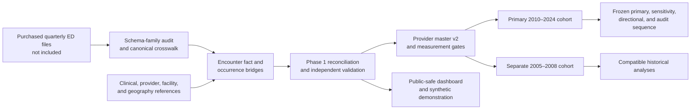

# Florida Emergency Department Data Engineering and Concordance Research

This repository is the public-safe, source-controlled handoff for a production Florida Emergency Department data-engineering and research-analytics project. It documents how **148,686,146 encounter records** were standardized into **76 validated quarterly partitions** spanning **2005–2008 and 2010–2024**, how provider and facility measurement was strengthened, and how the frozen physician–patient concordance analysis was implemented.

## My role and contributions

I led and executed the end-to-end data-engineering and analytical workflow under faculty research guidance. My responsibilities included investigating the raw quarterly data and historical documentation; designing the five-schema standardization architecture; defining the clinical decoding, provider, facility, and visit-level enhancement rules; constructing the validated analytical cohorts; specifying and operating the large-scale analytical pipeline; investigating failures; reconciling outputs to source records; and preparing the reproducible code, validation evidence, dashboard, and documentation presented here.

Faculty collaborators established and refined the broader research questions and provided methodological guidance, while a physician collaborator provided clinical feedback during the exploratory stage. The implemented workflow, execution decisions, validation controls, and submitted portfolio documented in this repository represent my work and responsibility.

Current status: **Phase 1 is complete and independently validated. Phase 2 measurement, cohort construction, historical analyses, and primary race M1–M3 estimation are complete; primary gender M1 is complete. Remaining primary and sensitivity analyses and the final independent analytical-release audit are pending.** No incomplete effect estimates are reported.

The repository contains no purchased encounter files, row-level records, patient identifiers, provider identifiers, facility identifiers, model matrices, coefficient tables, or unpublished numerical concordance results.

## Start here

| Goal | Open |
|---|---|
| Understand what is complete and what remains | [PROJECT_STATUS.md](PROJECT_STATUS.md) |
| Navigate the repository | [docs/REPOSITORY_NAVIGATION.md](docs/REPOSITORY_NAVIGATION.md) |
| Understand and resume the analytical pipeline | [docs/HANDOFF_AND_RESUMPTION_GUIDE.md](docs/HANDOFF_AND_RESUMPTION_GUIDE.md) |
| Review the research methods | [METHODOLOGY.md](METHODOLOGY.md) and [docs/frozen_methodology/Statistical_Analysis_Plan.md](docs/frozen_methodology/Statistical_Analysis_Plan.md) |
| Open the Power BI dashboard | [dashboard/README.md](dashboard/README.md) |
| Run the fictional demonstration | [synthetic_demo/README.md](synthetic_demo/README.md) |
| Review privacy and disclosure limits | [DATA_ACCESS_AND_PRIVACY.md](DATA_ACCESS_AND_PRIVACY.md) |
| Verify source provenance | [SOURCE_PROVENANCE.csv](SOURCE_PROVENANCE.csv) and [REPOSITORY_INVENTORY.csv](REPOSITORY_INVENTORY.csv) |

## What Phase 1 built

Phase 1 converts five materially different source layouts into one canonical encounter fact containing **342 standardized fields**, plus diagnosis, procedure, clinical-grouping, comorbidity, provider, and facility artifacts. Each quarter is assigned to one approved schema family before transformation:

1. 2005–2008
2. 2010–2015 Q3
3. 2015 Q4–2017
4. 2018–2022
5. 2023–2024

Years **2009 and 2025** are excluded by project instruction. The raw source directories remain immutable. Source-to-fact row reconciliation, generated encounter-key uniqueness, year exclusions, schema conformance, bridge integrity, physician-master uniqueness, facility uniqueness, and final-release structure were independently checked. See [evidence/phase1_build_summary.json](evidence/phase1_build_summary.json) and [evidence/phase1_validation_summary.json](evidence/phase1_validation_summary.json).

Clinical processing retains source slots and code provenance. ICD-9-CM diagnoses and procedures use era-appropriate CCS resources; ICD-10-CM diagnoses use CCSR; ICD-10-PCS and CPT/HCPCS procedures use their corresponding references. Elixhauser indicators are derived with separate ICD-era rules and external-cause fields are excluded from comorbidity assignment. Unsupported concepts are not fabricated: true triage, reliable revisit measurement, and same-facility admission remain explicitly unavailable where source semantics do not support them.

## What Phase 2 built

Provider master v2 contains **1,813,546 unique NPIs** and covers the complete emergency-department-observed NPI universe. The entity rules keep MD/DO physicians separate from nurse practitioners, physician assistants, other individual clinicians, and organizational NPIs. No organizational NPI is classified as an MD/DO physician.

Physician race/ethnicity is an algorithm-inferred full-name probability vector. The primary construction uses official `wru` **2.0.0** name likelihoods and a **2020** Florida physician prior; a national prior is retained for sensitivity analysis. Residential geography is not used, the method is not BISG, and the output is not self-reported identity. Physician gender uses recorded NPPES/CMS administrative categories in the primary measure and is labeled with its limitations. See [evidence/provider_v2_summary.json](evidence/provider_v2_summary.json).

The corrected primary cohort reconciles **60 quarterly partitions and 119,543,044 rows** to the immutable Phase 1 facts. The separate historical cohort reconciles **16 partitions and 23,304,846 rows** for 2005–2008. The two periods are not silently pooled. Historical analyses passed their independent audit, but their numerical findings are not disclosed here.

The primary race M1–M3 computations and primary gender M1 computation are checkpointed. Primary gender M2 must restart from its beginning after hash validation. Gender M3, outcome-specific models, corrected primary AMI, directional dyads, measurement sensitivities, multiplicity, and the final independent analytical-release audit remain pending. A completed model file is not treated as a released finding until its required audit passes.

## Power BI dashboard

The seven-page dashboard is a public-safe project-status and engineering portfolio, not a results dashboard. It includes:

- executive scope and current status;
- quarterly coverage and five-schema standardization;
- clinical decoding and visit-level enhancement coverage;
- provider and facility measurement;
- cohort and analytical design;
- validation, reconciliation, and fictional reproducibility evidence;
- completion, safe-pause, and handoff controls.

Open [dashboard/powerbi_project/Florida_ED_Project_Portfolio_Dashboard.pbip](dashboard/powerbi_project/Florida_ED_Project_Portfolio_Dashboard.pbip) in Power BI Desktop. Its 15-table semantic model uses embedded public-safe metadata, 8 relationships, 34 measures, 7 pages, and 76 visuals. Static checks passed **17/17**, and all seven pages passed Power BI Desktop render review. See [dashboard/dashboard_qa/POWER_BI_DESKTOP_RENDER_QA.json](dashboard/dashboard_qa/POWER_BI_DESKTOP_RENDER_QA.json).

## Reproducible code

`src/phase1/` contains the validated Phase 1 source snapshots selected for the original portfolio. `src/phase2_full/` contains all **108** Phase 2 Python and PowerShell source files present at the handoff, including measurement, cohort, estimator, sensitivity, directional-dyad, multiplicity, recovery, reporting, and independent-audit stages. These are source snapshots only; restricted inputs and numerical outputs are not included.

The project began with an approximately **0.5% exploratory sample containing 743,767 rows**. That prototype helped develop early decoding and enrichment concepts, but it is not presented as the production pipeline and is not reconstructed here.

To run the fictional demonstration and repository checks:

```powershell
python synthetic_demo/generate_synthetic_data.py
python synthetic_demo/run_demo_pipeline.py
python -m pytest -q
python scripts/validate_public_repository.py
python scripts/validate_release_repository.py
```

The fictional demonstration contains 800 generated rows and is deterministic. It does not estimate physician–patient concordance.

## Repository architecture



## Interpretation boundary

This is an observational research workflow. The repository documents engineering, measurement, specifications, validation, and computational status. It does not authorize treatment-outcome conclusions, disclose unfinished numerical results, or redistribute the underlying data. Use the controlled status and frozen specifications rather than inferring completion from the presence of a script or output filename.

## Repository status

This is a sanitized public portfolio release containing reproducible source code, frozen methodological specifications, validation evidence, documentation, dashboard assets, and a fictional demonstration. Restricted source data, row-level identifiers, model matrices, and unpublished numerical research results are excluded.
