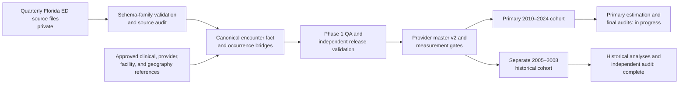

# Florida Emergency Department Data Engineering and Concordance Research

This repository documents a production data-engineering build that standardized **148,686,146 Florida emergency-department encounter records into 76 validated quarterly partitions** covering **2005–2008 and 2010–2024**. Phase 1 is complete and independently validated. The broader research analysis is ongoing: Phase 2 measurement, cohort construction, historical analyses, and specifications are complete, while primary-period estimation and final analytical audits remain in progress. [Phase 1 build evidence](evidence/phase1_build_summary.json) · [validation evidence](evidence/phase1_validation_summary.json) · [current status](evidence/current_project_status.json)

No real encounter or provider-level data are included here. The repository contains sanitized production code, aggregate QA evidence, methodology notes, and a deterministic synthetic demonstration. No incomplete effect estimates are reported.

## What was built

Phase 1 converts five source-schema families into a single encounter fact with **342 standardized fields**, one generated production visit key per released encounter, and linked diagnosis, procedure, CCS/CCSR, Elixhauser, physician, facility, QA, documentation, and summary artifacts. The source years exclude **2009 and 2025 by instruction**, and the raw files were not modified. [Build evidence](evidence/phase1_build_summary.json)

The five layouts were not handled as one loose union. Each quarter is assigned to an approved family—**2005–2008; 2010–2015 Q3; 2015 Q4–2017; 2018–2022; or 2023–2024**—then checked against the expected columns before transformation. That boundary matters because the pipeline also enforces ICD-9-CM through 2015 Q3 and ICD-10-CM beginning in 2015 Q4. [Build evidence](evidence/phase1_build_summary.json) · [validation evidence](evidence/phase1_validation_summary.json)

Clinical processing retains normalized diagnosis and procedure occurrences, mapping provenance, source slots, and era-appropriate code systems. ICD-9-CM diagnoses and procedures use CCS mappings; ICD-10-CM diagnoses use CCSR; ICD-10-PCS and CPT/HCPCS procedures use their appropriate reference families. Elixhauser indicators are built from secondary diagnoses with separate ICD-era logic. Visit enhancements cover decoded demographics, payer, disposition, timing, charges, procedure counts, and explicitly labeled proxies. Measures that cannot be supported—true triage, same-facility admission, and reliable revisits—remain structurally unavailable rather than being inferred.

Provider and facility work is kept separate from encounter standardization. The provider master records practitioner roles, direct or historical license-based linkage, experience, taxonomy/specialty, affiliations, and source provenance. Facility outputs preserve identifier and name histories and add current CMS, geography, rurality, composition, and charge summaries with clear temporal limits.

## Phase 2: completed foundations, unfinished estimation

Provider master v2 contains **1,813,546 unique NPIs** and covers the complete ED-observed NPI universe. Entity and clinician rules distinguish MD/DO physicians, nurse practitioners, physician assistants, other individuals, and organizations; no organizational NPI is classified as an MD/DO. [Provider evidence](evidence/provider_v2_summary.json)

Physician race/ethnicity is an **algorithm-inferred full-name probability**, not self-reported identity. The primary method uses official `wru` **v2.0.0** name likelihoods with a **2020 AAMC Florida physician prior**; the national prior is a required sensitivity. It does not use residential geography, is not BISG, and does not treat a practice address as a residence. Physician gender in the primary measure uses recorded NPPES/CMS administrative categories, with the limitations of those current-source fields stated directly. [Provider measurement evidence](evidence/provider_v2_summary.json)

The corrected primary cohort was rebuilt from the immutable Phase 1 facts and passed validation for **60 quarterly partitions and 119,543,044 rows**. The separate historical cohort reconciles **16 partitions and 23,304,846 rows** for 2005–2008; its analyses passed an independent audit and are not pooled silently with the primary period. [Primary cohort evidence](evidence/phase2_cohort_summary.json) · [historical evidence](evidence/historical_validation_summary.json)

The primary race estimator is still running. Primary gender, outcome-specific, directional-dyad, corrected primary AMI, multiplicity, and final-release audits remain pending unless a later terminal PASS is recorded. See [PROJECT_STATUS.md](PROJECT_STATUS.md) for the controlled status table.

## Development path

The work began with an approximately **0.5% exploratory sample containing 743,767 encounter rows**. That prototype was used to develop early decoding, provider/facility enrichment, and reporting concepts for faculty and a physician collaborator. It informed the production redesign, but it did not necessarily use every final definition. The original sample, its results, and uncorrected notebooks are not included, and the public demonstration does not reconstruct it. [Status and development evidence](evidence/current_project_status.json) · [design history](docs/prototype_to_production.md)

## Architecture



The fuller architecture and control points are in [docs/architecture.md](docs/architecture.md).

## Run the synthetic demonstration

The commands below use only the Python standard library for the demo; `pytest` is listed for the test suite.

```bash
python synthetic_demo/generate_synthetic_data.py
python synthetic_demo/run_demo_pipeline.py
python -m pytest -q
python scripts/validate_public_repository.py
```

Generated inputs and outputs are ignored by Git. Expected aggregate outputs are committed under `synthetic_demo/expected_outputs/` so that a clean run can be compared byte for byte. The demo is deliberately smaller and simpler than production and does not estimate any concordance association.

## Repository map

| Path | Purpose |
|---|---|
| `src/phase1/` | Sanitized production copies for preparation, partition construction, provider/facility enhancement, and release validation |
| `src/phase2/` | Sanitized provider-v2, cohort, model-matrix, HDFE, historical, linkage, multiplicity, and directional-definition code |
| `synthetic_demo/` | Fictional inputs, standardization pipeline, and expected aggregate outputs |
| `evidence/` | Whitelisted aggregate claims with source filenames, SHA-256 hashes, and extraction timestamps |
| `docs/` | Architecture, development history, and validation summary |
| `tests/` | Reproducibility, public-safety, and documented-claim checks |
| `scripts/` | Evidence builder and independent repository validator |
| `configs/` | Synthetic configuration and a path-free production template |

## Interpretation boundary

The analytical models are observational and are designed to estimate associations under specified adjustment and fixed-effect structures. This repository does not make causal claims, redistribute underlying data, or disclose unfinished coefficients, confidence intervals, p-values, q-values, or treatment-outcome conclusions. Data-access and disclosure rules are summarized in [DATA_ACCESS_AND_PRIVACY.md](DATA_ACCESS_AND_PRIVACY.md); code provenance is recorded in [REPOSITORY_INVENTORY.csv](REPOSITORY_INVENTORY.csv).
