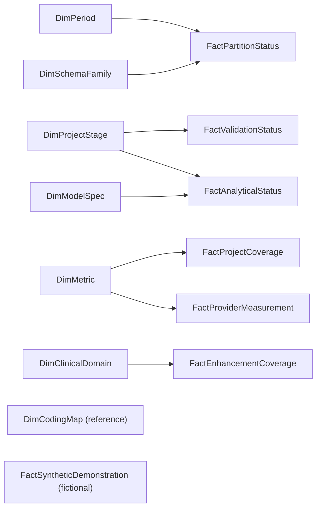

# Power BI data model

## Design

The package uses a compact constellation/star model. Each table has one declared grain. Relationships are one-to-many and single-directional. Blank optional foreign keys are allowed only for excluded quarters or components without an M1-M3 designation. Do not enable automatic bidirectional filtering.

## Model diagram

## Relationships

| From | To | Cardinality | Cross-filter |
|---|---|---:|---|
| DimPeriod[PeriodKey] | FactPartitionStatus[PeriodKey] | 1:* | Single |
| DimSchemaFamily[SchemaFamilyKey] | FactPartitionStatus[SchemaFamilyKey] | 1:* | Single |
| DimProjectStage[StageKey] | FactValidationStatus[StageKey] | 1:* | Single |
| DimProjectStage[StageKey] | FactAnalyticalStatus[StageKey] | 1:* | Single |
| DimMetric[MetricKey] | FactProjectCoverage[MetricKey] | 1:* | Single |
| DimMetric[MetricKey] | FactProviderMeasurement[MetricKey] | 1:* | Single |
| DimClinicalDomain[ClinicalDomainKey] | FactEnhancementCoverage[ClinicalDomainKey] | 1:* | Single |
| DimModelSpec[ModelSpecKey] | FactAnalyticalStatus[ModelSpecKey] | 1:* | Single |

The relationship from DimModelSpec to FactAnalyticalStatus ignores blank ModelSpecKey values. The relationship from DimSchemaFamily to FactPartitionStatus ignores blank SchemaFamilyKey values for excluded years.

## Grains

- **DimPeriod:** One row per calendar quarter from 2005 Q1 through 2025 Q4. Primary key: PeriodKey.
- **DimSchemaFamily:** One row per approved historical source-schema family. Primary key: SchemaFamilyKey.
- **DimProjectStage:** One row per project stage. Primary key: StageKey.
- **DimMetric:** One row per dashboard metric. Primary key: MetricKey.
- **DimClinicalDomain:** One row per clinical or enhancement domain. Primary key: ClinicalDomainKey.
- **DimCodingMap:** One row per source-code-system to grouping rule. Primary key: CodingMapKey.
- **DimModelSpec:** One row per M1-M3 model stage. Primary key: ModelSpecKey.
- **FactProjectCoverage:** One row per high-level project metric. Primary key: ProjectMetricKey.
- **FactPartitionStatus:** One row per calendar quarter from 2005 Q1 through 2025 Q4. Primary key: PartitionKey.
- **FactEnhancementCoverage:** One row per implemented, proxy, or structurally unavailable enhancement. Primary key: EnhancementKey.
- **FactProviderMeasurement:** One row per public-safe provider measurement metric. Primary key: ProviderMetricKey.
- **FactValidationStatus:** One row per high-value validation control. Primary key: ValidationKey.
- **FactAnalyticalStatus:** One row per project or analytical component. Primary key: AnalyticalStatusKey.
- **FactSyntheticDemonstration:** One row per fictional demonstration metric. Primary key: DemoMetricKey.

## Measure organization

Create an empty display table named **Measures** and place measures into the display folders listed in METRIC_AND_MEASURE_DICTIONARY.csv. Hide all technical keys, sort-order columns, source-artifact keys, and disclosure-class fields from Report view after relationships and sort-by-column settings are complete.

## Refresh behavior

The public dashboard is a static, public-safe snapshot. Refresh reads only dashboard_data/POWER_BI_IMPORT.xlsx. It must never point to the private Phase 1 or Phase 2 workspace. Regenerate the handoff package from approved source metadata before any future refresh.

## Public/private boundary

Only public-safe metadata and explicitly fictional data are present. Real encounter rows, provider/facility identifiers, purchased files, model matrices, and numerical concordance estimates are absent. A future private research dashboard must be a separate file and must not replace this source workbook.
