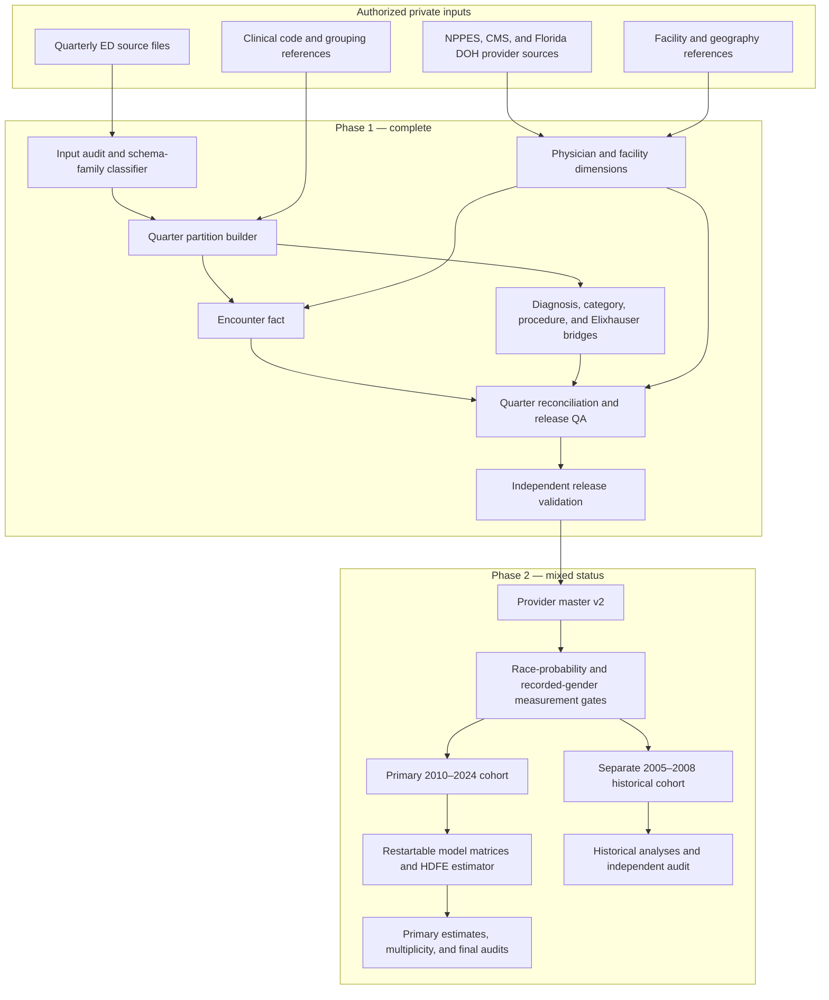

# Architecture and control points

The private production system is partition-first. Each quarter is validated and transformed independently, then reconciled before it can enter the release. Provider, facility, and clinical references are built as controlled dimensions or decoders rather than mixed into ad hoc notebook joins.

## Phase 1 controls

1. The source-quarter audit records file identity, columns, row counts, and expected schema family.
2. The builder rejects unapproved schemas and applies the ICD transition by year and quarter.
3. Encounter keys remain unique even when released source identifiers repeat.
4. Diagnosis and procedure occurrences are written separately from the encounter fact, preserving code position and mapping provenance.
5. Physician roles are kept distinct; facility history and current enrichments carry explicit time semantics.
6. Quarter manifests reconcile source rows to fact rows and bind produced files by hash.
7. Independent release validation checks partition counts, field counts, uniqueness, exclusions, structural nulls, dimensions, documentation, and required artifacts.

## Phase 2 controls

Provider master v2 is built from the union of the Phase 1 master and all validated ED-observed NPIs. Measurement QA verifies entity rules, clinician types, full-name probability bounds, prior provenance, recorded-gender source rules, and coverage of the ED-observed universe.

The primary cohort is rebuilt from immutable Phase 1 facts and validated across every primary-period partition. The historical cohort separately preserves all historical encounters and records linkage or measurement eligibility as flags. Neither track is allowed to overwrite Phase 1.

Model preparation writes hash-bound, restartable matrices in the private workspace. The estimator checkpoints demeaning progress without making partial results public. Measurement, model-definition, multiplicity, and independent-result audits are separate gates, so a file’s existence does not establish analytical completion.

## Public boundary

Only the shaded logic represented by documentation, sanitized code, aggregate evidence, and synthetic fixtures is reproduced in this repository. Private inputs, intermediate arrays, provider rows, fitted results, and machine-specific runtime locations remain outside it.
